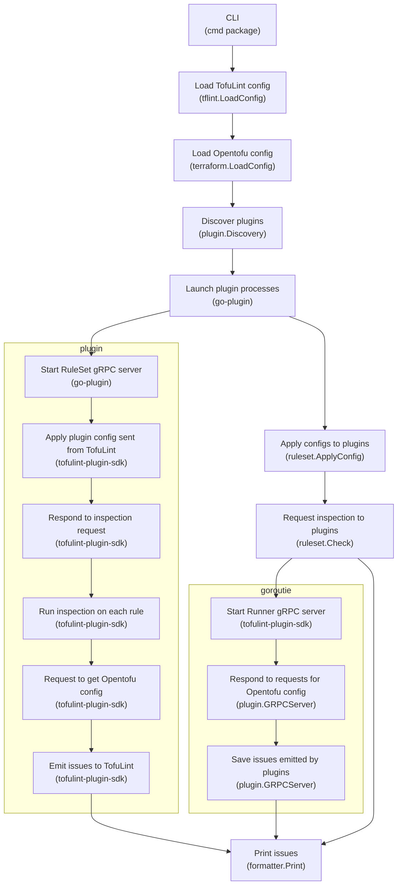
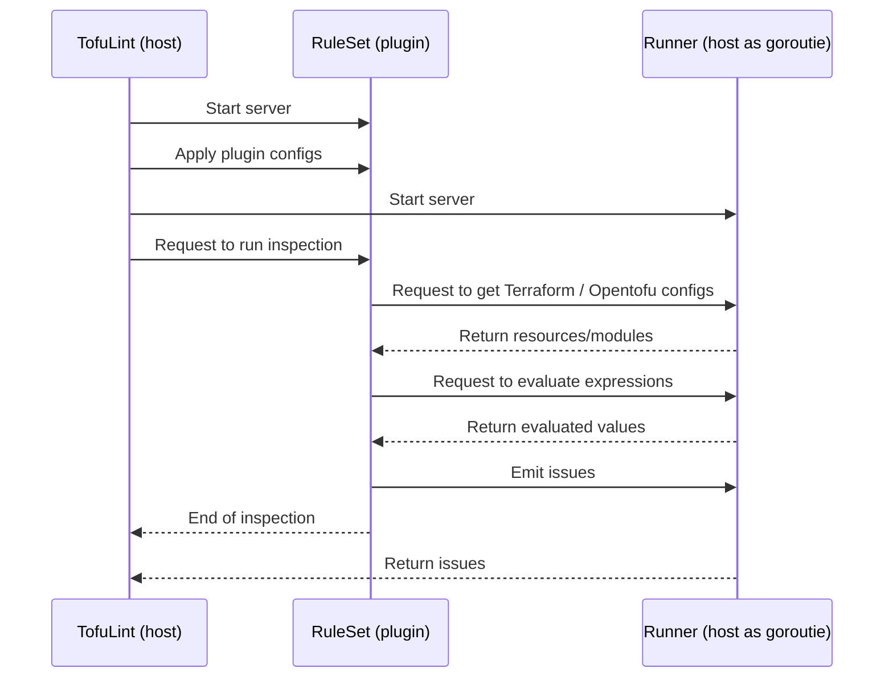

# Architecture

TofuLint is a pluggable linter and does not contain any rule implementations. Rules are provided as plugins, these are launched by TofuLint as subprocesses and communicate over gRPC.

An important part of understanding TofuLint's and with that Tflint's architecture is that TofuLint (host) and a plugin act as both gRPC server/client.

For example, the plugin (client) to the host (server) requests to:

- Retrieve Opentofu configs (e.g. `aws_instance.main`)
- Evaluate expressions (e.g. `var.foo`)
- Save reported issues to the host server

The host (client) to the plugin (server) requests to:

- Apply plugin configs
- Request to run inspections

The plugin system is implemented by [TofuLint plugin SDK](https://github.com/arsiba/tofulint-plugin-sdk). If you want to know more about `*.proto` and detailed gRPC server/client implementation, check out the SDK.

## Inspection Flow Diagram

The following diagram explains how an inspection is performed when a user executes command:

### CLI (`cmd` package)

[The `cmd` package](https://github.com/arsiba/tofulint/tree/master/cmd) is the entrypoint of the CLI. `cmd.CLI` has streams to stdout/stderr and prints a result to the screen.

Depending on the user's instructions, it does the following:

- Run inspection
- Initialize TofuLint (install plugins)
- Start language server
- Print version info
- Run bundled plugin (internal use)

This package is responsible for parsing CLI flags and arguments. The parsed `cmd.Option` is converted to `tflint.Config` and merged with a config file.

### Load TofuLint config (`tflint.LoadConfig`)

[The `tflint` package](https://github.com/arsiba/tofulint/tree/master/tflint) provides many features related to TofuLint, such as loading a config file (`.tflint.hcl` / `.tofulint.hcl`) and parsing annotations (`# tflint-ignore` comments).

The `tflint.LoadConfig` loads a config file and returns `tflint.Config`. This config will be used in later steps.

### Load Opentofu config (`opentofu.LoadConfig`)

[The `opentofu` package](https://github.com/arsiba/tofulint/tree/master/opentofu) is a fork of [https://github.com/opentofu/opentofu/internal](https://github.com/opentofu/opentofu/internal). This package is responsible for processing the Opentofu and Terraform semantics, such as parsing `*.tf` / `*.tofu` files, evaluating expressions, and loading modules.

The `opentofu.LoadConfig` reads `*.tf` / `*.tofu` files as a `opentofu.Config` in the given directory. These structures are designed to be as similar to Opentofu / Terraform core. See "The Design of `opentofu` Package" section below for details.

### Discover plugins (`plugin.Discovery`)

[The `plugin` package](https://github.com/arsiba/tofulint/tree/master/plugin) is responsible for the plugin system. This package contains gRPC server implementation, installation, discovery, etc.

The `plugin.Discovery` discovers installed plugins and launches plugin binaries as subprocesses. This detailed implementation is hidden by [github.com/hashicorp/go-plugin](https://github.com/hashicorp/go-plugin).

### Launch plugin processes (go-plugin)

The go-plugin launches a plugin binary as a subprocess. The launched plugin acts as a gRPC server and communicates with the host process.

The plugin server is called "RuleSet" server. Its behavior is implemented by a plugin developer.

### Apply configs to plugins (`ruleset.ApplyConfig`)

The `plugin.Discovery` returns a client for the RuleSet server it started. Use the `ApplyConfig` method to send the plugin config described in the config file to the server.

### Request inspection to plugins (`ruleset.Check`)

Similarly, send inspection requests to the server. The server responds to requests and runs an inspection, but the plugin needs access to `terraform.Config` (imagine `runner.GetResourceContent`).

For this, the host process launches a gRPC server to respond such requests. Ths host server is called "Runner" server. Its behavior is implemented by TFLint. The plugin is passed a client that corresponds to the Runner server.

### Respond to requests for Terraform config (`plugin.GRPCServer`)

The Runner server responds to requests from plugins to retrieve Terraform configs, evaluate expressions, etc. This implementation is contained in the `plugin` package.

### Save issues emitted by plugins (`plugin.GRPCServer`)

The Runner server saves issues emitted by plugins (imagine `runner.EmitIssue`). The saved issues will be printed to the screen in the next step.

### Print issues (`formatter.Print`)

[The `formatter` package](https://github.com/arsiba/tofulint/tree/master/formatter)  processes and outputs issues in formats such as default, JSON, and SARIF.

## Inspection Sequence Diagram

The following diagram explains how the host process, RuleSet server, and Runner server each behave in inspection:

